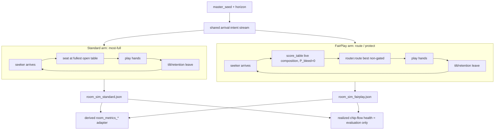

# Playsim Routing Comparison — Closed-Loop Room Simulator

## Summary

Turn playsim's hand-authored routing comparison into a real closed-loop room simulator: a shared seeded stream of seekers arrives over a configurable horizon (default 8 hours), each placed by a swappable seating policy, so retained paid seat-time and table health emerge as genuine consequences of routing *decisions* rather than of pre-built table compositions. Standard (most-full open table) is compared against FairPlay routing (the frozen backend router) on an identical arrival stream, built incrementally and validated at 2h → 4h → 8h.

## Problem Frame

The FairPlay claim is that risk-aware routing increases retained paid seat-time by steering vulnerable players away from predatory mixes. Today's `playsim routing` command tests this with two **hand-authored rosters** (`routing_standard` / `routing_fairplay`): the same cohort is dropped into two compositions a human wrote. The outcome is partly baked into how those rosters were authored — it demonstrates that *a healthy composition retains players better than an unhealthy one*, which is nearly tautological, not that *the routing policy produces the healthy composition*.

The real frozen router (`backend/scoring/router.py`) — `0.30·Fit + 0.40·Health + 0.30·ΔHealth` with integrity and vulnerable-protection gates — is never called by playsim. Nothing in the simulator makes a seating *decision*. Closing that loop is what converts the demo's headline metric from "compositions differ" into "the policy that chose the seats earned the seat-time," which is the claim the product actually makes.

## Key Decisions

- **Full closed-loop room simulator as the target, built incrementally.** The architecture is the dynamic room (arrivals over time, tables open/fill/break, policy-chosen seats, players leave). It is delivered MVP-first and validated progressively at 2h → 4h → 8h against identical seeded arrivals, rather than as a single big-bang 8-hour run.

- **Most-full open table is the Standard baseline.** Real cardrooms and online lobbies fill the busiest game with a seat for liquidity. Choosing this over random/first-available makes the null honest and hard to beat — if FairPlay still wins on paid seat-time, the result is credible rather than a strawman victory.

- **Two FairPlay variants, reported separately.** `route` (always seats the best non-gated table) ships first and isolates *placement quality*. `protect` (may defer/balk a vulnerable seeker when only sub-threshold seats are open) is a later policy switch that isolates the *safety/balk* trade-off. They are never blended into one headline.

- **Predicted health from the backend scorer, realized health for evaluation only.** FairPlay decisions call the composition-driven backend `score_table()` on each candidate table's live seated set, with `P_bleed` held at 0 (composition terms only). Playsim's realized chip-flow health is evaluation-only and never feeds a routing decision — this is what keeps the comparison a real test rather than a tautology.

- **Clean A/B: only arrival intents are shared.** A single seeded arrival-intent stream (who seeks, when) is replayed identically across both arms; placements and departures are policy-derived and diverge by design — that divergence *is* the causal signal. Health-modulated arrival rates are deliberately excluded from the A/B so both arms see identical demand.

- **Canonical playsim-native output; v1 metrics are a derived adapter.** The simulator defines its own full-causal-trace schema first; the existing `room_metrics_*` shape is generated from it as a compatibility adapter, not treated as the source of truth.

## Architecture

## Requirements

**Room loop & horizon**

- R1. A closed-loop room simulator runs a configurable horizon (default 8h), advancing in discrete time steps; tables fill, break when they fall below the minimum, and seats reopen as players leave.
- R2. The run exposes inspectable room state at the 2h, 4h, and 8h checkpoints so the loop can be validated progressively.
- R3. End-to-end determinism: `(master_seed, horizon, policy, agent_model)` reproduces byte-identical output; per-table and per-decision seeds derive from the master seed.

**Arrivals & demand**

- R4. A single seeded arrival-intent stream — which player seeks a seat, at what sim-time — is generated once and replayed identically across both policy arms. Arrival intents are policy-independent.
- R5. The arrival pool draws from `players.json` players not seated in the hour-0 `table_roster.json`, each carrying a classification/archetype.
- R6. No health-modulated arrival rates in the A/B MVP — demand is identical across arms.

**Seating policies**

- R7. A pluggable seating-policy interface; the room loop is policy-agnostic and selects the active policy by config switch, not a code fork.
- R8. Standard policy seats the seeker at the fullest table with an open seat (most-full / liquidity-seeking); it balks only when zero seats are open room-wide.
- R9. FairPlay-route seats the seeker at the best non-gated table per the backend `router.route()`; it ships first.
- R10. FairPlay-protect may defer or balk a vulnerable seeker when all open seats are below a safety threshold; it is a later policy switch and is reported separately, never blended into the route headline.

**Predicted health & circularity**

- R11. FairPlay routing computes predicted health by calling the backend composition-driven scorer (`score_table()`) on each candidate table's live seated composition at decision time, with `P_bleed` held at 0.
- R12. Playsim realized chip-flow health is evaluation-only and must never feed a routing decision.
- R13. Later phases may add richer router inputs if and only if they are available at decision time without reintroducing realized-outcome circularity.

**Departures & sessions**

- R14. Departures use the existing tilt/retention leave model — a player logs off when their loss-shortened session budget is spent — so paid-seat-time decay is an emergent outcome.
- R15. Placements and departures are policy-derived and diverge across arms; only arrival intents are shared.

**Agent brain seam**

- R16. The agent-brain seam (pluggable `act()` policy) is preserved. RLCard / OpenSpiel / CFR-style brains are out of the MVP.
- R17. The output records `agent_model` and `agent_version` metadata so every corpus is attributable to the brain that produced it.

**Outputs & schema**

- R18. The canonical output is playsim-native `room_sim_{standard,fairplay}.json` carrying the full causal trace: `meta` (seeds, `agent_model`/`agent_version`, run config), arrival intents, routing decisions, seat_events, sessions, hourly timeline, table timelines, and summary metrics.
- R19. The playsim-native schema is defined first; v1-compatible `room_metrics_{standard,fairplay}.json` is generated from it as a derived adapter layer only — not the source of truth.
- R20. Canonical and derived outputs write to `playsim/out/` first; promotion into `data/` (the demo swap) is a later deliberate step.

**Metrics**

- R21. The primary metric is retained paid seat-time for the vulnerable cohort.
- R22. Secondary metrics include rec loss velocity, realized table health, table breaks, churn, and winnings concentration; FairPlay-protect additionally reports balk rate, deferred seekers, and prevented bad sessions.

## Key Flows

- F1. Room tick and seating decision
  - **Trigger:** An arrival intent fires at the current sim-time for a seeker not yet seated.
  - **Steps:** Loop gathers tables with open seats → applies the active policy (Standard: pick fullest; FairPlay: score each candidate's live composition via `score_table` with `P_bleed=0`, then `router.route()` to the best non-gated table) → records a routing decision and a seat_event → hands are dealt → the leave model updates session budgets and emits departures, reopening seats.
  - **Outcome:** The same intent yields a policy-specific placement; the room state advances one step.
  - **Covered by:** R1, R4, R7, R8, R9, R11, R14, R18.

- F2. Vulnerable seeker under route vs protect
  - **Trigger:** A vulnerable (new/recreational) seeker arrives when only sub-threshold or gated tables have open seats.
  - **Steps:** FairPlay-route seats them at the best *available* non-gated table even if its predicted health is poor; FairPlay-protect instead defers/balks and records the seeker as deferred.
  - **Outcome:** Route trades placement for liquidity; protect trades liquidity for safety. Each arm's effect is reported on its own metric set.
  - **Covered by:** R9, R10, R12, R22.

## Acceptance Examples

- AE1. Shared-intent divergence
  - **Given** one arrival intent (player P seeks at minute T) and two arms.
  - **When** the run executes Standard and FairPlay over the identical intent stream.
  - **Then** P may be placed at a different table in each arm, and both placements trace back to the same intent record.
  - **Covers R4, R15.**

- AE2. Route never balks while a seat exists
  - **Given** every healthy table is full but a non-gated unhealthy table has an open seat.
  - **When** a vulnerable seeker arrives under FairPlay-route.
  - **Then** they are seated at the best available non-gated table; no balk is recorded.
  - **Covers R9.**

- AE3. Protect defers below threshold
  - **Given** only tables below the safety threshold have open seats.
  - **When** a vulnerable seeker arrives under FairPlay-protect.
  - **Then** the seeker is deferred/balked and counted in balk rate / deferred seekers, not seated.
  - **Covers R10, R22.**

- AE4. Gated tables are never offered
  - **Given** a table with a seated high-band cluster (integrity-gated).
  - **When** any FairPlay variant routes a seeker.
  - **Then** that table is excluded from the candidate set regardless of its numeric health.
  - **Covers R9, R11.**

- AE5. Determinism
  - **Given** identical `(master_seed, horizon, policy, agent_model)`.
  - **When** the simulator is run twice.
  - **Then** the `room_sim_*.json` outputs are byte-identical.
  - **Covers R3.**

## Success Criteria

- The 2h → 4h → 8h checkpoints each produce internally consistent room state from the *same* seeded arrival stream across both arms.
- The Standard-vs-FairPlay-route delta on retained paid seat-time is produced entirely by routing decisions and the leave model — no hand-authored compositions in the path.
- The circularity guardrail holds by construction: routing reads composition-driven predicted health; realized chip-flow health appears only in evaluation output.
- The canonical `room_sim_*.json` is rich enough that the v1 `room_metrics_*` adapter and any later frontend view can be derived from it without re-running the simulator.

## Scope Boundaries

**Deferred for later**
- Wiring the frontend Room Impact Simulator to read the new output, and promoting outputs from `playsim/out/` into `data/` — the adapter is produced; the demo swap is a separate deliberate step.
- FairPlay-protect's full tuning and reporting beyond the policy-switch seam (route ships first).
- Health-modulated / demand-response arrivals (λ ∝ Health^γ) as a *separate* experiment, never inside the A/B.
- Richer router inputs at decision time, added only if available without realized-outcome circularity.

**Outside this effort's identity**
- RLCard / OpenSpiel / CFR-style agent brains — the seam is preserved but no brain is built here.
- The LLM / AI Investigator layer — this effort produces evidence and outcomes, not case summaries.
- Deprecation/removal of `backend/sim` — orthogonal cleanup.

## Dependencies / Assumptions

- `data/derived/classifications.json` covers every player in the arrival pool (run `backend/scripts/build_classifications.py` if any are missing); `score_table` and the agents both need an archetype per player.
- The backend scorer (`backend/scoring/health.py:score_table`, `backend/scoring/router.py:route`) is importable from playsim at decision time, or a thin seam wraps it; `score_table` is composition-driven and accepts a live seated set, which the loop already has.
- The existing `runner.run_session` retention/tilt leave model and quota-leave mechanics are the substrate the room loop builds on (Phases B/C of the prior plan — seating the unseated pool and exporting sessions/seat_events — become this loop's inputs and outputs rather than separate goals).
- A "safety threshold" for FairPlay-protect (the predicted-health floor below which a vulnerable seeker is deferred) is a tunable the protect phase introduces; its default is set during that phase.

## Outstanding Questions

**Deferred to planning**
- Time-step granularity and how arrival intents are spaced (fixed tick vs. event-driven arrival times) — both satisfy R4; pick during planning against the existing minutes-per-hand model.
- Whether table open/reopen/break thresholds are configurable or fixed for the MVP.
- Exact field layout of the canonical `room_sim_*` schema and the adapter mapping to v1 `room_metrics_*` — shape is specified (R18/R19); field-level layout is a planning artifact.
