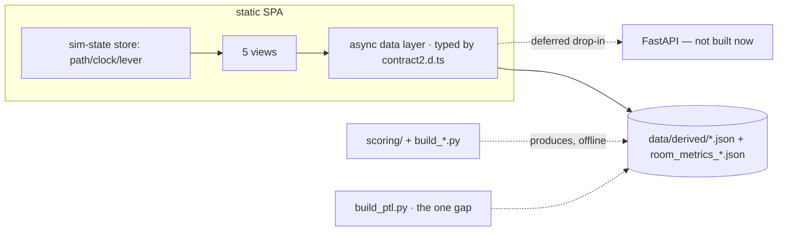
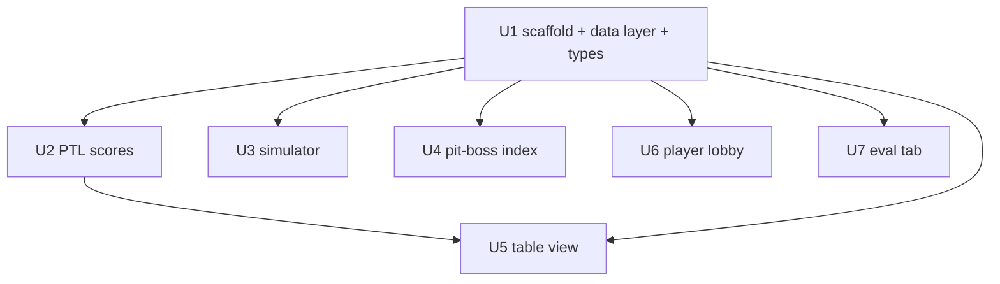

# feat: FairPlay Demo UI

## Summary

Build the FairPlay demo as a **static Vite/React/TS SPA** that binds directly to P3's frozen Contract-2 outputs (`data/derived/*.json`) and the shipped types (`frontend/contract2.d.ts`): three views (Pit Boss index, Pit Boss table view with the per-seat PTL seat-ring + folded integrity, personalized player lobby) plus the Standard-vs-FairPlay simulator frame and a small eval tab. No demo-owned scoring and no live server in scope — scoring is P3's engine; PTL (per-seat propensity to leave) is the one missing score and the only computation this plan adds. A live FastAPI is **deferred**: revisit only if an interactive moment (e.g., per-hour re-compute) earns it after the click path works.

---

## Problem Frame

A capstone review panel needs to *see* the FairPlay thesis work end-to-end — the Standard-vs-FairPlay divergence from a shared start, the per-seat propensity-to-leave that makes "table health" legible, and the system **refusing** to escalate a benign shared-device household. P3 has now shipped the scores (Contract 2) and a typed, guardrail-enforcing contract; this plan is the UI that renders them. Full motivation and product decisions live in the origin requirements doc (see Sources & References).

---

## Requirements

Traced to the origin doc (`docs/brainstorms/2026-06-21-demo-ui-requirements.md`); IDs match origin R-IDs. **Note:** R20/R21 named a live FastAPI; per the post-P3 transport decision they are now satisfied by reading frozen Contract-2, with FastAPI deferred (see Key Technical Decisions).

**Simulation & comparison frame**
- R1. Standard and FairPlay paths share hour-0 and replay 8 hours from fixtures.
- R2. One sim-time control (play/pause/scrub, 0–8) drives every time-varying view.
- R3. Adherence lever: 0% ≡ Standard path, 100% ≡ FairPlay path.
- R4. Comparison surfaces room KPIs (`room_metrics_*`) for both paths and their divergence.
- R5. The lever changes retention *and* the integrity outcome (low → cluster forms at T-11; high → seat held).

**Pit Boss index**
- R6. Tables ranked healthiest-first using operator-facing health scores/bands.
- R7. Re-ranks live as the clock advances and as the lever changes.
- R8. May show operator-facing context (band, risk flags) — operator-only view.

**Pit Boss table view**
- R9. Seat-by-seat composition with each seat's PTL.
- R10. Flagged table surfaces the integrity case inline: evidence grouped by family, counter-evidence, monitor-vs-escalate call.
- R11. Operator actions per `docs/PRD.md` §5, drawn from the case's `recommended_action` / allowed actions.

**Player lobby**
- R12. Personalized ranking (Fit + ΔHealth over a shared table Health), not raw health.
- R13. Neutral player-safe info + badge (Recommended for you / Good fit / Available); gated tables absent.
- R14. Reflects the player's personalized routing (Fit recompute is P3's; the UI binds the result).

**Eval / guardrails**
- R15. Flagged-case views always show uncertainty language and counter-evidence — never a bare accusation.
- R16. Eval tab: seeded cases with expected vs. predicted + safety checks (grounding, no-overclaiming, counter-evidence, action quality).
- R17. The player lobby never exposes numeric health scores, classifications, risk scores, or integrity language.
- R18. No view states a player cheated as fact or recommends auto-enforcement; integrity language is operator-only.

**Platform & data**
- R19. React (Vite) SPA; all data access through one async data layer.
- R20. Bind to P3's Contract-2 (`data/derived/*.json`); the data layer is transport-agnostic so a future API serving identical shapes is a drop-in (FastAPI deferred).
- R21. The demo runs entirely from committed frozen JSON — no live server required.
- R22. Per-seat PTL is produced (the one score not yet in Contract-2); per-hour table health is sourced for live re-rank (see Open Questions).

**Origin actors:** A1 Presenter, A2 Pit boss, A3 Player, A4 Capstone reviewer, A5 Scoring engine (P3)
**Origin flows:** F1 Standard-vs-FairPlay run, F2 Pit-boss triage of the cluster, F3 Player routing moment, F4 Eval/proof review
**Origin acceptance examples:** AE1 (covers R3, R5), AE2 (covers R12, R13, R17), AE3 (covers R10, R15, R18), AE4 (covers R7), AE5 (covers R21)

---

## Scope Boundaries

- Real device/location/OSINT, trained-model integrity detection, enforcement/auto-ban, KYC/AML, real-time routing — non-goals (the production graph in `docs/graph/` stays out).
- Promo-abuse and bot-similarity cases beyond what is already seeded — deferred (PRD cut-first list).
- A standalone Case Detail screen — folded into the Pit Boss table view.
- High-fidelity visual polish beyond what reads as credible to reviewers.
- Demo-owned scoring — removed; P3's engine is the source of truth (Contract 2).

### Deferred to Follow-Up Work

- **Live FastAPI scoring API** — deferred by decision; revisit only if an interactive recompute moment (e.g., per-hour re-rank, seating arbitrary players live) earns it after the click path works. The data layer keeps it a drop-in.
- Author mock eval packets for cases B/D/F/G (only A/C/E exist today); until then the eval tab shows those four as expected-only.
- Per-seat PTL as a first-class P3 champion (`scoring/ptl.py`) if P3 adopts it — see U2.

---

## Context & Research

### Relevant Code and Patterns

- **`docs/p1-integration-guide.md`** — P3's authoritative wiring: which `data/derived/*.json` feeds which screen (§2), screen-by-screen field shapes (§3), the player/operator rule (§0). **Primary reference for this plan.**
- **`frontend/contract2.d.ts`** — shipped TypeScript types for every Contract-2 file; `LobbyTable` is structurally narrowed and operator types are branded `OperatorOnly<T>` (compile-time guardrail). Import, don't re-author.
- `data/derived/*.json` — frozen Contract-2: `classifications`, `integrity_scores`, `health_scores`, `seating_scores`, `router_lobby` (the last splits `operator_view` 🔴 vs `player_lobby` 🟢).
- `data/room_metrics_standard.json` / `data/room_metrics_fairplay.json` — the 8-hour KPI series for the simulator.
- `data/seeded_case_labels.json` — operator answer key (7 cases) for the eval tab; never player-facing.
- `scoring/*.py` + `scripts/build_*.py` — P3's engine and the regenerate scripts (`python scripts/build_<score>.py`); reference for adding `build_ptl.py`.
- `docs/scoring-thresholds.md` — band cutoffs (legend source of truth).

### Institutional Learnings

- None in `docs/solutions/` (greenfield repo).

### External References

- Skipped — mature stack (React/Vite + a chart lib), no high-risk domains, transport now settled (static frozen JSON, per P3 integration guide §0/§1).

---

## Key Technical Decisions

- **Static SPA over frozen Contract-2.** Bind the UI to `data/derived/*.json` via one async data layer; no live Python in the demo. Matches P3's integration guide ("you never call Python live; you read JSON") and D0. FastAPI deferred.
- **Consume P3's engine; compute nothing except PTL.** Health, integrity, Fit, ΔHealth, seating-risk, router rank+badge, and classifications all come from Contract 2. The demo adds only per-seat PTL (U2).
- **Import `contract2.d.ts`; guardrail is compile-time.** Player screens bind to `LobbyTable` only; `OperatorOnly<T>` makes leaking operator data into a lobby component a compile error. The runtime "no-leak" test becomes a backstop, not the primary defense.
- **Render the "why" from data.** Show `reason_codes[].detail`, `signal_families`, and `counter_evidence` verbatim — never hand-written explanation copy (PRD DoD; guide §5).
- **One frontend sim-state store** (path + clock + adherence) drives all time-varying views (R2).
- **Transport-agnostic data layer.** `loadX()` functions return typed Contract-2 shapes from frozen JSON now; swapping to `fetch()` later changes the implementation, not call sites (types already describe both per `contract2.d.ts`).

---

## Open Questions

### Resolved During Planning

- Transport: static frozen JSON now; FastAPI deferred until an interactive moment earns it.
- Scoring ownership: P3 owns all Contract-2 scores; the demo adds only PTL.
- Lever is continuous; mid-positions interpolate between the two frozen `room_metrics_*` endpoints (labeled illustrative).
- Eval tab reads committed answer key + score files; mock packets exist only for A/C/E.

### Deferred to Implementation

- **Per-hour table health for live re-rank (R7/AE4).** `health_scores.json` is a single current snapshot. Live hour-by-hour re-ranking needs per-hour health: either P3 freezes a per-hour health series, or this becomes the candidate interactive moment that justifies revisiting FastAPI. Resolve before U4's re-rank is built. **Coordinate with P3.**
- **PTL ownership** — add `scoring/ptl.py` + `build_ptl.py` (P3 pattern, preferred) vs. derive UI-side from `seating_scores` + `classifications` + health terms. See U2.
- Chart library choice (e.g., Recharts vs. visx).
- pydantic→TS sync is moot (types hand-shipped in `contract2.d.ts`); keep them in sync if Contract-2 shapes change.

---

## Output Structure

    fairplay-simulation-lab/
    ├── data/derived/*.json        # P3 Contract-2 (consumed, not created here)
    ├── frontend/
    │   ├── contract2.d.ts         # P3 types (consumed)
    │   └── src/
    │       ├── data/              # NEW — async shim over data/derived/*.json
    │       ├── state/             # NEW — sim-state store (path/clock/lever)
    │       ├── views/             # NEW — simulator, pit-boss index, table, lobby, eval
    │       └── components/        # NEW — seat-ring, KPI cards, evidence panel, badges
    └── scripts/build_ptl.py       # NEW (optional, U2) — freeze per-seat PTL scores

---

## High-Level Technical Design

> *Directional guidance for review, not implementation specification.*

Lever / path → outcome mapping (drives F1 and AE1):

| Adherence | Path | P-104 routing | Cluster 3rd seat (T-11) | Room KPIs |
|---|---|---|---|---|
| 0% | Standard | seated at T-22 | seated → cluster forms | `room_metrics_standard` |
| 100% | FairPlay | routed to T-8 | held for review | `room_metrics_fairplay` |
| between | interpolated | proportional | proportional | interpolated (labeled illustrative) |

---

## Implementation Units

### U1. Frontend scaffold + data layer + sim-state store

**Goal:** Vite/React/TS SPA that loads frozen Contract-2 through one typed async data layer, with the sim-state store and shared view-state conventions.

**Requirements:** R19, R20, R21, R2

**Dependencies:** None

**Files:**
- Create: `frontend/` (Vite React-TS app), `frontend/src/data/shim.ts`, `frontend/src/state/simStore.ts`, `frontend/tests/shim.test.ts`, `frontend/tests/simStore.test.ts`
- Consume: `frontend/contract2.d.ts` (P3 types), `data/derived/*.json`, `data/room_metrics_*.json`

**Approach:**
- `shim` exposes `async loadX()` functions returning the `contract2.d.ts` types (e.g. `loadRouterLobby(): RouterLobbyFile`, `loadHealth(): HealthScoresFile`, `loadRoomMetrics(path)`). Today they import/fetch the committed JSON; the signatures are transport-agnostic so a later API is a drop-in. Call sites never branch on transport.
- `simStore` holds `{ path, hour, adherence }` and notifies subscribers; views derive from it.
- Shared view-state conventions (loading / empty / error→fallback), defined once and reused by all five views.
- Vite dev server; the build is a static bundle openable without a server.

**Patterns to follow:** integration guide §1–§2; `contract2.d.ts` type names.

**Test scenarios:**
- Happy: each `loadX()` returns data typed to the matching Contract-2 interface.
- Integration (Covers AE5): missing/failed source degrades to a defined empty/error state without throwing (and the static build runs with no server).
- Happy: store updates (advance hour, change lever, toggle path) notify subscribers.

**Verification:** all views render from the typed shim; store changes propagate; static build opens standalone.

---

### U2. PTL scores (the one scoring gap)

**Goal:** Produce per-seat **PTL** (propensity to leave, 0–1) for seated players at a table — the only score not in Contract-2 — with reason codes.

**Requirements:** R9, R22

**Dependencies:** U1

**Files:**
- Create (preferred): `scripts/build_ptl.py` → `data/derived/ptl_scores.json`; `scripts/validate_ptl.py`
- Alternative: `frontend/src/data/ptl.ts` (UI-side derivation) + `frontend/tests/ptl.test.ts`

**Approach:**
- PTL is per-(player×table): Layer 1 baseline volatility (archetype from `classifications.json` + `avg_session_minutes` vs `ARCHETYPE_SESSION_BASELINE` + `sessions_last_30d` + promo signals) × Layer 2 table pressure (Fit mismatch + `seating_risk` + table band + `P_pred`). Archetype-gated: **vulnerable archetypes (new/recreational) carry the signal; predators/grinders/anchors sit low; promo_hunter spikes once qualified.**
- Direction contract with U5: PTL ∈ [0,1], 1.0 = most likely to leave. **Victims/fish are hot, colluders/predators are cool** (at T-11: P-150 high, P-CA/CB/CC low).
- Preferred home is a P3-style champion (`build_ptl.py`) so it's first-class Contract-2 with reason codes; coordinate with P3. UI-side derivation is the fallback if P3 won't own it.
- Calibrate against realized leaves once the counterfactual plays out (`P_bleed` truncations / `seat_events` exit reasons).

**Patterns to follow:** `scripts/build_seating.py`; `scoring/seating.py` `fit()`; `scoring/health.py` baselines.

**Test scenarios:**
- Happy: at T-11, PTL(P-150) ≫ PTL(P-CA) (victim hotter than colluders).
- Happy: P-104 PTL high at T-22 (predatory) and low at T-8 (balanced).
- Edge: grinder/anchor PTL stays low regardless of table; player with zero `lifetime_hands` handled.
- Happy: deterministic; emits reason codes (`{code, detail, signals}`).

**Verification:** seat-ring values match the demo story (fish about to bolt at unhealthy tables).

---

### U3. Simulator comparison view

**Goal:** Standard-vs-FairPlay frame — KPI cards, 8-hour divergence chart, sim-clock, adherence lever.

**Requirements:** R1, R3, R4, R5

**Dependencies:** U1

**Files:**
- Create: `frontend/src/views/Simulator.tsx`, KPI/chart components in `frontend/src/components/`, `frontend/tests/simulator.test.tsx`

**Approach:**
- Bind KPI cards + divergence chart to `room_metrics_standard.json` / `room_metrics_fairplay.json` `hours[]` (guide §3e); `hour_note` gives per-hour captions for free. Clock + lever are store-driven; both paths side-by-side. Mid-lever interpolates between the two endpoints (labeled illustrative).

**Patterns to follow:** guide §3e KPI field set.

**Test scenarios:**
- Happy: KPI cards render both paths; divergence chart plots hours 1–8.
- Happy (Covers AE1): lever 0% → Standard KPIs + cluster formed; 100% → FairPlay KPIs + seat held.
- Happy: scrubbing the clock updates the displayed hour across the frame.

**Verification:** the frame tells the with/without story and responds to clock + lever.

---

### U4. Pit Boss index view

**Goal:** Operator table list ranked healthiest-first, re-ranking as clock/lever change.

**Requirements:** R6, R7, R8

**Dependencies:** U1

**Files:**
- Create: `frontend/src/views/PitBossIndex.tsx`, `frontend/tests/pitBossIndex.test.tsx`

**Approach:**
- Bind to `health_scores.json` (band, `terms`, `integrity_candidate`, reason codes) and `router_lobby.json → operator_view` for rank context. Operator-facing context (band, flags) allowed. `integrity_candidate: true` → "surface to review" flag (T-11). Row click → table view.
- **Re-rank over hours depends on per-hour health** — resolve the Open Question first (P3 per-hour series, or scope re-rank to current snapshot until then).

**Patterns to follow:** guide §3b; health bands in `scoring-thresholds.md`.

**Test scenarios:**
- Happy: tables render ranked healthiest-first with band/flags; T-22=38 beginner-unfriendly, T-11 flagged `integrity_candidate`.
- Happy (Covers AE4): advancing the clock re-orders as health changes (gated on per-hour health).
- Happy: changing the lever re-ranks (integrity formation affects health).

**Verification:** ranking is data-driven, not hard-coded; flags fire only where `integrity_candidate`.

---

### U5. Pit Boss table view (+ folded integrity)

**Goal:** Seat-ring with per-seat PTL + the integrity case folded in for flagged tables + operator actions.

**Requirements:** R9, R10, R11, R15, R18

**Dependencies:** U1, U2

**Files:**
- Create: `frontend/src/views/PitBossTable.tsx`, `frontend/src/components/SeatRing.tsx`, evidence/case components, `frontend/tests/pitBossTable.test.tsx`

**Approach:**
- Render the round seat-ring: seats from `table_roster.json`, archetype per seat from `classifications.json`, PTL heat from U2 (PTL ∈ [0,1], ≥0.7 red / 0.4–0.7 amber / <0.4 green; victims hot, predators cool). Dealer button + open seats.
- Vitals from `health_scores.json` (health, band, `terms`). For a flagged table, read the integrity block from `integrity_scores.json → assessments[]`: `signal_families` grouped, `counter_evidence` rendered **next to** the finding (hard guardrail), `recommended_action` offered as a confirm (never auto-execute). Render `detail` verbatim. Band reads `neutral`, never `monitor`. Unflagged tables → quiet "No integrity flags" placeholder.

**Patterns to follow:** guide §3b/§3c/§3d; `IntegrityAssessment` type.

**Test scenarios:**
- Happy: seats render with PTL; opening flagged T-11 shows `signal_families` (4) + `counter_evidence` + monitor/escalate call.
- Happy (Covers AE3): the household table (H-01) renders band `neutral` with `household_counter_evidence`, action `monitor` — not escalated.
- Happy: actions offered from `recommended_action`/allowed set; `detail` strings rendered verbatim.
- Guardrail (Covers R15, R18): flagged-case view always shows counter-evidence + uncertainty; never states cheating as fact.

**Verification:** flags are defensible (convergence + counter-evidence visible); household reads as not-escalated.

---

### U6. Player lobby view

**Goal:** Personalized, structurally score-free lobby with neutral badges.

**Requirements:** R12, R13, R14, R17

**Dependencies:** U1

**Files:**
- Create: `frontend/src/views/PlayerLobby.tsx`, `frontend/tests/playerLobby.test.tsx`, `frontend/tests/lobbyGuardrail.test.tsx`

**Approach:**
- Bind **only** to `router_lobby.json → routed[i].player_lobby` typed as `LobbyTable[]` (guide §3a). Render `badge_label` chips; show neutral table facts; gated tables are already absent. A player selector (preset demo players, default P-104) picks `routed[i]`.
- **Never** import operator types here — `OperatorOnly<T>` makes a leak a compile error; that is the primary guardrail.

**Patterns to follow:** guide §0/§3a; `LobbyTable` type.

**Test scenarios:**
- Happy (Covers AE2): P-104 → T-8 "Recommended for you", T-14 "Good fit", T-22 "Available"; T-11 absent.
- Guardrail (Covers AE2, R17): component is typed to `LobbyTable`; a test that attempts to pass an operator row fails to compile (type-level), plus a runtime backstop scanning rendered output for forbidden fields/terms.
- Happy: switching the selected player swaps the routed lobby.

**Verification:** lobby is personalized and provably score-free (compile-time + runtime).

---

### U7. Eval / proof tab

**Goal:** Show the seeded eval cases with expected vs. predicted and safety checks.

**Requirements:** R16, R15

**Dependencies:** U1

**Files:**
- Create: `frontend/src/views/EvalPanel.tsx`, `frontend/tests/evalPanel.test.tsx`

**Approach:**
- Bind to `seeded_case_labels.json` (expected) + the score files (computed): integrity `band` vs `expected_category`, etc. Render all 7 expected labels; full predicted + safety checks (grounding, no-overclaim, counter-evidence, action quality) for the 3 cases with packets (A/C/E); B/D/F/G expected-only. Show a true-risk-above-traps ranking with a visible separator. Never expose the answer key in any player path.

**Patterns to follow:** guide §3f; `seeded_case_labels.json`.

**Test scenarios:**
- Happy: renders all 7 expected labels; A/C/E show predicted + checks; true-risk ranks above traps (CASE-C high above CASE-E neutral).
- Happy: per-case safety checks render from data.

**Verification:** the eval tab visibly measures grounding/no-overclaiming against the answer key.

---

## System-Wide Impact

- **Interaction graph:** the sim-state store drives the simulator, the index, and (for selected player/hour) the table view — a store bug affects all time-varying views.
- **Error propagation:** the data layer is the one place a missing/failed source is handled; views treat `loadX()` as fallible.
- **State lifecycle:** clock + lever must keep cross-view state consistent (no view showing a different hour/path than the frame).
- **API surface parity:** the player/operator wall is enforced by P3 at the data layer *and* by `contract2.d.ts` at compile time — do not subvert it by casting away `OperatorOnly` or rebuilding the lobby from raw `table_roster.json`.
- **Unchanged invariants:** `data/derived/*.json`, `data/*.json`, and `contract2.d.ts` are read-only inputs; this plan does not modify P3's engine (PTL is additive).

---

## Risks & Dependencies

| Risk | Mitigation |
|------|------------|
| Live re-rank needs per-hour health that Contract-2 doesn't yet emit | Open Question gated before U4 re-rank; either P3 freezes per-hour health or re-rank is the trigger to revisit FastAPI. |
| PTL ownership/calibration drifts from P3's model | Prefer a P3-pattern `build_ptl.py` champion with reason codes; calibrate against realized `P_bleed`/exit events; U2 validator pins the case players. |
| Lobby accidentally leaks operator data | Compile-time `LobbyTable`/`OperatorOnly` (primary) + runtime backstop test (U6); never reconstruct lobby from raw roster. |
| Mockups/deck use illustrative numbers that differ from the engine | Use engine values for live screens (guide §7: healthy tables ≈ 93, not ~81; only T-22=38 pinned; badge ordering identical); update static assets before they become slides. |
| Contract-2 shape changes upstream | `contract2.d.ts` is the single type source; a shape change surfaces as a type error at the data layer. |

---

## Sources & References

- **Origin document:** [docs/brainstorms/2026-06-21-demo-ui-requirements.md](docs/brainstorms/2026-06-21-demo-ui-requirements.md)
- **P3 integration guide:** `docs/p1-integration-guide.md` · **types:** `frontend/contract2.d.ts`
- Contract-2 data: `data/derived/*.json` · simulator: `data/room_metrics_*.json` · eval key: `data/seeded_case_labels.json`
- Engine + regenerate: `scoring/*.py`, `scripts/build_*.py` · thresholds: `docs/scoring-thresholds.md`
- Model reference: `docs/index.html` (note drift, guide §7) · actions/bands: `docs/PRD.md` §5, `docs/graph/fixture-vocab-mapping.md`
