# feat: Playsim closed-loop room simulator (Standard vs FairPlay routing)

## Summary

Add a closed-loop room simulator to `playsim/` that places a shared seeded arrival-intent stream over a configurable horizon (default 8h) under swappable seating policies, so retained paid seat-time and table health emerge from routing *decisions* rather than hand-authored compositions. The headline MVP compares Standard (most-full open table) against FairPlay-route (the real frozen `backend/scoring` router); FairPlay-protect ships behind the same seam as an experimental, untuned policy. Output is a playsim-native `room_sim_{standard,fairplay}.json` causal trace with a derived v1 `room_metrics_*` compatibility adapter.

---

## Problem Frame

Today `playsim routing` (and `service.simulate_routing`) compares two hand-authored rosters (`routing_standard` / `routing_fairplay` in `playsim/playsim/rosters.py`): the same cohort dropped into two compositions a human wrote. That demonstrates "a healthy composition retains players better than an unhealthy one" — nearly tautological — not that *the routing policy produces the healthy composition*. The real frozen router (`backend/scoring/router.py`) is never exercised by the simulator, and nothing in playsim makes a seating *decision*.

This plan closes the loop. playsim remains the simulator owner (arrivals, hands, departures, sessions, table breaks, realized chip-flow health, output); the backend is consulted *only* at the FairPlay decision point. The result converts the demo headline from "compositions differ" into "the policy that chose the seats earned the seat-time" — the claim the product actually makes. See origin: `docs/brainstorms/2026-06-23-playsim-routing-comparison-requirements.md`.

---

## Requirements Traceability

All R/AE/F IDs below are from the origin document.

| Origin requirement | Where addressed |
|---|---|
| R1, R2 room loop + 2h/4h/8h checkpoints | U5, U8 |
| R3 end-to-end determinism | U1, U5, U6 (tests in U1, U5, U6, U8) |
| R4, R5, R6 shared seeded arrival intents, unseated pool, no demand modulation | U3 |
| R7 pluggable policy seam | U4 |
| R8 Standard most-full | U4 |
| R9 FairPlay-route via backend router | U2, U4 |
| R10 FairPlay-protect as a later switch | U4 |
| R11, R12, R13 predicted health at decision time, realized eval-only, no circularity | U2, U5 |
| R14, R15 tilt/retention departures, policy-derived placements/departures | U1, U5 |
| R16, R17 agent-brain seam preserved; provenance metadata | U6 |
| R18 canonical causal-trace output | U6 |
| R19 v1 adapter is derived only | U7 |
| R20 outputs to `playsim/out/` first | U8 |
| R21 primary metric: vulnerable paid seat-time | U6, U8 |
| R22 secondary metrics (+ protect balk/defer metrics) | U6 |
| AE1–AE5 | Test scenarios in U3, U4, U5, U6 |
| F1 room tick / seating decision | U4, U5 |
| F2 vulnerable seeker under route vs protect | U4 (defer/route decision), U5 (clock/departures), U6 (per-arm metrics, R22) |

---

## Key Technical Decisions

- **playsim owns the loop; backend is consulted only at the FairPlay decision.** Arrivals, hands, departures, sessions, breaks, realized health, and output are all playsim. The backend router/scorer is called *only* to choose a FairPlay placement. Standard policy does not call the backend to choose seats (evaluation output may still derive comparable health labels for both arms). This keeps the circularity guardrail trivially satisfiable and the simulator self-contained.

- **A single cross-package adapter (`playsim/playsim/router_adapter.py`) is the only place that imports backend.** It follows the sanctioned seam from `backend/app/room.py` and `backend/scripts/build_router.py`: `sys.path.insert(0, str(root / "backend"))` then `from scoring.router import route`, `from scoring.health import score_table, score_all_tables, build_cluster_band_index`, `from scoring.integrity import score_integrity`. No other playsim module imports backend, and playsim never writes `import backend.scoring`.

- **Decision-time predicted health is composition-driven with `P_bleed = 0`.** The adapter passes the live seated composition (with `sessions=None`/no playsim future sessions) to `score_table`, so only the composition terms (`P_pred`, `P_frag`, `P_clus`) contribute. Realized chip-flow health (`playsim/health.py`) is computed for evaluation output only and never feeds a routing decision (R11–R13).

- **Do not reimplement the backend router.** FairPlay-route calls the actual `route()` and selects the highest-ranked non-gated open table from its result. The point is to test the real frozen policy, not a local approximation.

- **The room clock is a per-hand multi-table loop that generalizes the session loop — not an hour-chunked wrapper around `run_session`.** A session-long tilt-leave budget cannot be computed correctly if the session is chopped into independent per-hour `run_session` calls (each would see only its chunk's loss rate). The orchestrator instead owns cumulative per-player state and reuses the *primitives*: `play_hand`, the `skill_edge` transfer, `_effective_session_min`, `session_min_for`, `knobs_for`, `derive_table_seed`, and `features.aggregate`.

- **The shared per-hand accounting block is extracted from `run_session` mechanically.** The `skill_edge` zero-sum transfer + payoff/bust/rebuy block currently inlined in `run_session` is factored into one helper that both `run_session` and the room loop call, so the two cannot drift. The extraction is behavior-preserving and guarded by regression + determinism tests on `run_session`.

- **The int↔string id boundary is centralized in the adapter.** playsim keys players by `int`; `backend/scoring` uses `"P-*"` strings and table dicts. All conversion uses the existing `format_player_id` / `parse_player_id` (`playsim/playsim/population.py`) and lives in `router_adapter.py` — the single most error-prone seam, so it is single-sourced and unit-tested.

- **Cluster/integrity inputs are computed once.** `score_integrity` + `build_cluster_band_index` are seating-independent; the adapter computes them once per run and reuses them across every decision over the horizon (mirrors `backend/app/room.py:69-72`).

- **Two "vulnerable" sets exist and must not be conflated.** playsim's north-star cohort (`_COHORT`/`_WEAK` in `runner.py`) is `{new, recreational, promo_hunter}`; the backend's routing gate (`VULNERABLE_ARCHETYPES` in `seating.py`/`health.py`) is `{new, recreational}`. So a `promo_hunter` counts toward paid-seat-time and tilt-leave but is *not* protected by the vulnerable-protection gate. Paid-seat-time metrics (R21) use the playsim cohort; routing gates use the backend set. AE2/AE3 gate tests use `new`/`recreational` seekers to avoid the divergence.

- **Canonical output is playsim-native; v1 `room_metrics_*` is a pure derivation.** The full causal trace is defined first as the source of truth; the v1 schema is generated from it as a compatibility adapter for the existing frontend (`frontend/contract2.d.ts`), never the canonical shape.

- **The directional headline is an averaged claim.** "FairPlay-route ≥ Standard on vulnerable paid seat-time" holds in expectation over a seed set, not per-seed (the `skill_edge` model leaves per-seed variance). The comparison harness averages over multiple seeds and the headline test asserts the averaged claim.

---

## High-Level Technical Design

```mermaid
flowchart TB
  seed[master_seed + horizon + policy] --> intents[shared arrival-intent stream\nunseated players.json, seeded, policy-independent]
  intents --> loop

  subgraph loop[Room orchestrator — per-hand multi-table loop &#40;playsim&#41;]
    direction TB
    tick[advance clock] --> dep[departures: _effective_session_min tilt-leave -> open seats]
    dep --> arr{arrival intent due?}
    arr -->|yes| policy[[SeatingPolicy.choose]]
    policy --> seat[seat or balk -> seat_event]
    arr -->|no| play
    seat --> play[play_hand per active table + skill_edge economics]
    play --> brk[break tables < 2 seated]
    brk --> tick
  end

  policy -. Standard: most-full open table .-> standardP[no backend call]
  policy -. FairPlay: router_adapter .-> adapter

  subgraph adapter[router_adapter.py — only backend importer]
    direction TB
    conv[int -> P-* ids, live table dicts] --> cbi[integrity + cluster_band_index &#40;once&#41;]
    cbi --> ph[score_table live composition, P_bleed=0]
    ph --> rt[scoring.router.route] --> rec[placement rec + operator/reason meta]
  end

  loop --> canon[room_sim_standard.json / room_sim_fairplay.json\nmeta, run_config, arrival_intents, routing_decisions,\nseat_events, sessions, hourly + table timelines, summary]
  canon --> v1[derived room_metrics_*.json &#40;v1 frontend adapter&#41;]
  loop --> eval[realized chip-flow health = evaluation only]
```



---

## Output Structure

New and touched files (repo-relative):

```text
playsim/playsim/
  router_adapter.py                    # NEW: only backend importer; id + input assembly; route()
  arrivals.py                          # NEW: shared seeded arrival-intent stream
  policies.py                          # NEW: SeatingPolicy seam (Standard, FairPlay-route, FairPlay-protect)
  room.py                              # NEW: per-hand multi-table orchestrator
  room_export.py                       # NEW: canonical room_sim_* builder + v1 room_metrics_* derivation
  runner.py                            # MOD: extract shared per-hand accounting helper
  agent.py                             # MOD: agent_model / agent_version provenance
  baselines.py                         # MOD: agent_model / agent_version provenance
  service.py                           # MOD: simulate_room() entry point
  cli.py                               # MOD: room-sim subcommand
playsim/tests/
  test_room_adapter.py                 # NEW
  test_arrivals.py                     # NEW
  test_policies.py                     # NEW
  test_room.py                         # NEW
  test_room_export.py                  # NEW
  test_runner_extraction.py            # NEW (regression guard for U1)
playsim/README.md                      # MOD: soften stale "does not touch scoring/" language
playsim/out/                           # run artifacts (gitignored): room_sim_*.json, room_metrics_*.json
```

Final module names are the implementer's call; per-unit `**Files:**` are authoritative.

---

## Implementation Units

### Phase A — Foundations

### U1. Extract shared per-hand accounting helper from `run_session`

- **Goal:** Factor the inlined `skill_edge` transfer + payoff/bust/rebuy block out of `run_session` into one behavior-preserving helper that the room loop will also call, so the two paths cannot drift.
- **Requirements:** R3, R14, R15.
- **Dependencies:** none.
- **Files:** `playsim/playsim/runner.py`, `playsim/tests/test_runner_extraction.py`, plus confirm `playsim/tests/test_determinism.py` still passes.
- **Approach:** Identify the per-hand post-deal block in `run_session` (the `skill_edge` contest computation + zero-sum transfer, then the `persist_stacks` payoff/`net_session`/bust/rebuy updates). Extract into a helper that preserves the **exact current mutation order**: (1) `skill_edge` transfer on `rec.payoffs`; (2) per-seat `seat_minutes += min_per_hand` accrual; (3) `persist_stacks` payoff → `net_session` → bust/rebuy. The helper **returns all mutated per-player state** — `stacks`, `net_session`, `busts`, `seat_minutes`, `hands_played` — because the retention tilt-leave decision that stays in `run_session` reads all of them. `seat_minutes` accrual belongs **inside** the helper (it precedes the loss computation), so the caller's `_effective_session_min` budget comparison is unchanged. No signature change to `run_session`; no behavior change.
- **Note for U5:** the helper deliberately takes `members_by_player`/`weak_player_ids` as **explicit per-hand inputs** rather than reading session-scoped closures, so the room loop (U5) can pass table-scoped sets that change as composition churns. `run_session` keeps passing its once-computed roster-level sets — identical behavior for the fixed-roster case.
- **Execution note:** Characterization-first — capture current `run_session` outputs as a regression baseline before extracting, then refactor to green. **Land and commit U1 in isolation** (full existing suite + new regression tests green) **before** starting room orchestration (U4/U5); it is the riskiest unit because it touches calibrated behavior, and a clean checkpoint bounds the blast radius.
- **Patterns to follow:** existing `run_session` structure in `playsim/playsim/runner.py:174-256`; module-level helper style of `_effective_session_min`.
- **Test scenarios:**
  - Covers AE5. Determinism preserved: `run_session(roster, n, seed=42)` produces identical `features` and per-hand `payoffs`/boards before and after extraction (mirror `test_determinism.py`).
  - Quota-leave unchanged: replicate `test_population.py:41-57` (mixed `new`/`grinder` roster with `quota_hands`) and assert identical `hands_played`, `features[...]["hands_dealt"]`, and early-leaver absence post-extraction.
  - Retention unchanged: a `retention=True` session yields identical `seat_minutes`, `left_at_minute`, and `busts` before vs after.
  - Helper unit: given a synthetic hand record + stacks, the helper applies the zero-sum `skill_edge` transfer (sum of deltas ≈ 0) and rebuys a sub-threshold stack exactly once.
  - Return completeness: the helper returns updated `stacks`, `net_session`, `busts`, `seat_minutes`, and `hands_played`; a caller using only the returned dicts (no hidden in-place state) reproduces the pre-extraction tilt-leave decision exactly.
  - Per-hand inputs: passing distinct `members_by_player`/`weak_player_ids` to two calls changes soft-play/collusion outcomes accordingly (proves the sets are inputs, not closures).
- **Verification:** Full existing playsim suite green; new regression test green; no diff in any frozen determinism assertion.

### U2. Cross-package router adapter (`router_adapter.py`)

- **Goal:** One module that owns every backend interaction and all backend-shaped input assembly, exposing a single playsim-friendly placement function for FairPlay policies.
- **Requirements:** R9, R11, R12, R13.
- **Dependencies:** none (parallel with U1).
- **Files:** `playsim/playsim/router_adapter.py`, `playsim/tests/test_room_adapter.py`, `playsim/README.md` (docs note), and a relationships loader (add to `playsim/playsim/population.py` or inline in the adapter).
- **Approach:** Insert the backend path seam `sys.path.insert(0, str(root / "backend"))` (root from `find_data_root()`), then `from scoring.router import route`, `from scoring.health import score_table, score_all_tables, build_cluster_band_index`, `from scoring.integrity import score_integrity`. Reuse `load_players_by_id`, `load_classifications` (`playsim/playsim/population.py:30-49`); add a `load_relationships` for `data/relationships.json`. Provide:
  - id conversion wrappers over `format_player_id` / `parse_player_id`;
  - a builder that turns the room's live table state into backend table dicts carrying **every field the frozen scorer reads**, not just the lobby-safe set: `table_id`, `max_seats`, `seated_player_ids` (as `P-*`), `seated_count`, `open_seats`, **`style_volatility_label`** (read by `seating.style_key` for the Fit-matrix column — absent → silently defaults to `"mixed"`), **`paid_seat_time_trend`** (read by `health.p_frag` / ΔHealth — absent → silently defaults to `"stable"`), plus the `LOBBY_SAFE_FIELDS` stakes/game_type/pace fields. A dynamically-composed room table inherits `style_volatility_label` from its seed `table_roster` entry and derives `paid_seat_time_trend`, for MVP routing decisions, from the **fixture/table baseline** (the seed `table_roster` entry's trend) or a **deterministic occupancy-derived trend available at decision time** — **never** from future realized playsim chip-flow, which would blur the circularity guardrail. (Realized paid-seat-time trend is an evaluation-output quantity only, not a router input.);
  - a once-per-run `cluster_band_index` from `score_integrity` + `build_cluster_band_index`;
  - decision-time predicted health assembled as `health_by_id = {h.table_id: h for h in score_all_tables(live_tables, players_by_id, cbi, sessions=None)}` over the **exact `live_tables` set passed to `route`** — `route` indexes `health_by_id[tid]` for every table and `KeyError`s on a gap, so the full open-table set is scored each decision; `sessions=None` holds `P_bleed = 0`;
  - a `recommend(seeker_pid, live_tables, ...)` that calls `route(seeker_pid, live_tables, players_by_id, cbi, health_by_id, classifications)` (the `build_router.py` arg order), then selects the highest-rank `operator_view` entry whose `badge != "hidden_gated"` **and** whose live table currently has `open_seats > 0`, returning that `table_id` plus the operator/reason metadata for the causal trace, or `None` (balk) when no entry qualifies. The open-seat check at selection time is the adapter's responsibility (`route` only pre-filters against the dict it was handed, which can go stale as seats reopen mid-step).
- **Approach (docs):** Update `playsim/README.md` lines 10-12 to: "playsim does not perform scoring itself; the room-scale FairPlay policy can call backend `scoring`/`router` at decision time via `router_adapter.py`." Removes the retired "does not touch scoring/" boundary (per origin Dependencies and `docs/learn/playsim-vs-backend-path-forward.md`).
- **Patterns to follow:** `backend/app/room.py:21-31` (sys.path seam) and `:47-88` (input assembly + `_rescore`); `backend/scripts/build_router.py:30-42` (route inputs); `playsim/playsim/population.py:13-49` (loaders, id conversion).
- **Test scenarios:**
  - Covers AE4. A table holding a seated high-band cluster (use `CL-001`/`P-198..200` from `data/relationships.json`) is integrity-gated and never returned as a FairPlay placement.
  - ID seam round-trips: `parse_player_id(format_player_id(n)) == n` across the fixture range; a built table dict contains only `P-*` ids and consistent `seated_count` + `open_seats` (= `max_seats - seated_count`).
  - Predicted health is composition-only: adapter health for a table equals `score_table(..., sessions=None)` (terms show `P_bleed == 0`) and is independent of any realized chip flow.
  - `recommend` returns the highest-ranked non-gated open table for a low-risk seeker, and `None` (balk) when no open table exists.
  - cbi is computed once: integrity assembly is invoked a single time across repeated `recommend` calls in one run.
  - Scorer inputs honored: two tables with different `style_volatility_label` and `paid_seat_time_trend` produce different `fit`/`P_frag` (guards against the silent `"mixed"`/`"stable"` collapse).
  - Full-set scoring: `recommend` scores every table in `live_tables` and `route` is called with a `health_by_id` covering all of them — no `KeyError`.
  - Balk derivation: with all non-gated tables full (live `open_seats == 0`), `recommend` returns `None`; with one non-gated open seat it returns that table.
- **Verification:** Adapter imports backend cleanly from a playsim test; all scenarios green; no other playsim module imports backend.

### U3. Shared seeded arrival-intent stream

- **Goal:** Generate one deterministic, policy-independent stream of arrival intents (who seeks a seat, at what sim-time) replayed identically across both arms.
- **Requirements:** R4, R5, R6.
- **Dependencies:** none.
- **Files:** `playsim/playsim/arrivals.py`, `playsim/tests/test_arrivals.py`.
- **Approach:** Build the arrival pool from `data/players.json` players not seated in hour-0 `data/table_roster.json` (the unseated ~54), each carrying its classification/archetype. Emit a list of `ArrivalIntent(player_id, arrive_at_min)` over the horizon — **exactly one intent per pool player** (a player arrives once) — from a seed derived via `derive_table_seed`-style hashing (no `Date.now`/`Math.random`). Arrival rate is a fixed/flat schedule — explicitly **no** health-modulated rates (R6). The stream is generated once and consumed unchanged by both policy runs.
- **Patterns to follow:** `playsim/playsim/population.py` loaders + `derive_table_seed` (population.py:103-106); `Player` construction from fixtures.
- **Test scenarios:**
  - Covers AE1. The same seed yields a byte-identical intent list; both arms consume the identical list (assert object/stream equality feeding two runs).
  - Pool correctness: every arrival player_id is in `players.json` and absent from hour-0 `seated_player_ids`; each carries an archetype from `classifications.json`.
  - No demand modulation: stream is independent of any table-health input (function signature takes no health argument).
  - Different seed → different stream (counter-test, mirror `test_determinism.py:16-20`).
- **Verification:** Deterministic, pool-correct stream; both arms provably receive identical intents.

### Phase B — Loop and policies

### U4. Seating policy seam (Standard, FairPlay-route, FairPlay-protect)

- **Goal:** A pluggable policy interface the room loop selects by config, with the three policies behind it.
- **Requirements:** R7, R8, R9, R10; F1, F2 (F2's per-arm metrics aspect is delivered by U6).
- **Dependencies:** U2.
- **Files:** `playsim/playsim/policies.py`, `playsim/tests/test_policies.py`.
- **Approach:** Define `SeatingPolicy.choose(seeker, open_tables, room_state) -> table_id | None`. 
  - **Standard:** pick the open table with the highest `seated_count` (most-full); deterministic tie-break (e.g., lowest `table_id`); balk only when no open seat exists room-wide. No backend call.
  - **FairPlay-route:** delegate to `router_adapter.recommend`; choose the highest-ranked non-gated open table; balk only when none.
  - **FairPlay-protect:** same as route but may defer/balk a vulnerable seeker when the best available predicted health is below a provisional safety threshold. Disabled-by-default / clearly experimental; threshold is a provisional constant, **not tuned** in this MVP and not used for headline claims.
- **Patterns to follow:** `backend/scoring/router.py` badge/gate semantics (`_badge`, `integrity_gated`); selection from `operator_view`.
- **Test scenarios:**
  - Standard chooses most-full open table with deterministic tie-break; balks only when room is full.
  - Covers AE2. FairPlay-route seats a vulnerable seeker at the best available non-gated table even when all healthy tables are full; no balk while any non-gated seat exists.
  - FairPlay-route never selects a gated table (delegates AE4 to U2; asserts selection excludes gated entries).
  - Covers AE3. FairPlay-protect defers/balks when only sub-threshold seats are open and records the seeker as deferred; with the threshold disabled it behaves identically to route.
  - Policy is selected by config switch with no code fork in the loop (the loop calls the same `choose`).
- **Verification:** All three policies behave per spec behind one interface; route vs protect divergence only at the threshold.

### U5. Room orchestrator (per-hand multi-table loop)

- **Goal:** The closed-loop simulator: a per-hand multi-table loop over a configurable horizon that seats arrivals via the chosen policy, plays hands, departs players on tilt-leave, breaks tables, and records the causal trace primitives.
- **Requirements:** R1, R2, R3, R11, R12, R13, R14, R15, R21.
- **Dependencies:** U1, U2, U3, U4.
- **Files:** `playsim/playsim/room.py`, `playsim/tests/test_room.py`.
- **Approach:** Generalize the `run_session` loop to a global clock across all tables. The orchestrator owns cumulative per-player state (stacks, `net_session`, `hands_played`, `seat_minutes`, current table). Each step: (1) process departures via `_effective_session_min` → open seats + `seat_event`; (2) seat any arrival intents due this step via `policy.choose` → `routing_decision` + `seat_event`; (3) play one hand per active table with `play_hand` + the U1 accounting helper (incl. `skill_edge`); (4) break tables that fall below 2 seated. Realized chip-flow health is computed at the end from `playsim/health.py` for evaluation output only — never consulted during the loop (R12); a structural test asserts the `score_table` call site is reached only with `sessions=None` so realized state cannot leak into routing.
- **Determinism (R3/AE5) — load-bearing details.** Each table owns **one persistent `Random(derive_table_seed(master_seed, table_id))`** for its entire lifetime (not a fresh per-step seed), so its byte stream is stable regardless of how many hands preceded it. `table_id`s are **stable identifiers**, never reused or renumbered when a table breaks. Per-step processing iterates tables in a **sorted, stable key order**. Together these make byte-identical replay survive a mid-run table break. (Because placements differ by policy, the two arms legitimately diverge at the hand level — only the shared arrival-intent stream and aggregate seat-time are compared across arms; no test asserts cross-arm hand-level equality.)
- **Table-scoped collusion inputs.** `play_hand` consumes `members_by_player`/`weak_player_ids`, which `run_session` computes once for a fixed roster. The room loop must **recompute them per table from that table's current seated subset** (on each seating change) and pass them into the U1 helper's `play_hand` call — otherwise soft-play/collusion mechanics fire against players no longer seated together, corrupting realized chip flow and departures.
- **Per-player lifecycle.** `spread` is drawn **once at a player's first arrival** from a player-keyed derived seed (not per table, not per step); `net_session`/`hands_played`/`seat_minutes` **persist across re-seatings within a single room presence** so the `hp >= 15` tilt gate and loss-rate accrue continuously (a player who breaks-and-rejoins does not reset to zero and thereby dodge tilt). A balk-and-rejoin is treated as the same presence.
- **Room clock (MVP).** One global step = **one hand dealt per active table**, with all tables normalized to `hands_per_hour = 80` (the existing `min_per_hand` constant). Sim-time advances by `min_per_hand` per step; arrival intents and the 2h/4h/8h checkpoints are keyed to that accrued sim-time. Heterogeneous table pace (a table-local `next_hand_at_min` scheduler) is explicitly **out of MVP scope** — noted in Scope Boundaries as a later refinement.
- **Arrival & displacement lifecycle (explicit rules).** (a) Each unseated player has **exactly one** initial arrival intent — a player arrives once. (b) A **voluntary/tilt departure is terminal for the run** (gone for the day; does not re-enter the seeker pool). (c) A player **displaced by a table break** re-enters the seeker pool **once** and is routed by the active policy into one replacement seat, after a **deterministic delay** (0 or a fixed tick), and may balk if none qualifies. These rules apply identically to both arms (only the resulting placement differs).
- Emit raw structures (arrival_intents consumed, routing_decisions, seat_events, sessions, per-step state) for U6 to assemble. Horizon is configurable; the loop exposes inspectable state at 2h/4h/8h.
- **Patterns to follow:** `playsim/playsim/runner.py` loop (button rotation, persist/rebuy, retention leave); `playsim/playsim/health.py` `compute_health`/`compute_retention` for evaluation; `derive_table_seed` (population.py).
- **Test scenarios:**
  - Covers AE5. Determinism: same `(master_seed, horizon, policy)` → identical orchestrator output (twice-and-compare on routing_decisions, seat_events, sessions); different seed differs.
  - Checkpoints: state is inspectable and internally consistent at 2h, 4h, 8h on the same arrival stream across both arms (seated counts ≤ max_seats; open_seats consistent).
  - Departures are policy-derived: a high-loss vulnerable player leaves earlier under the predatory placement; `left_at_minute` is set and the seat reopens.
  - Realized health never feeds routing: assert no call path from `playsim/health.py` into `policy.choose`/adapter during the loop (structural/seam test; realized health only computed post-loop).
  - Table break: a table dropping below 2 seated breaks and emits a break event; displaced players re-enter the seeker pool exactly once (after the deterministic delay) and are routed by the active policy or balk — voluntary/tilt leavers do not return.
  - Replay survives a break: a run whose timeline includes a mid-horizon table break is byte-identical on re-run (guards the persistent-per-table-RNG + stable-table_id + sorted-iteration invariants).
  - Table-scoped collusion: when a `cluster_member` leaves a table, soft-play/collusion mechanics stop applying at that table on subsequent hands (proves `members_by_player`/`weak_player_ids` are recomputed from the live seated set).
  - Re-seat lifecycle: a player who breaks-and-rejoins keeps accumulating `hands_played`/`net_session`/`seat_minutes` across tables (crosses the `hp >= 15` tilt gate; does not reset), and `spread` is drawn once.
  - Primary metric present: run yields vulnerable-cohort paid seat-time (north-star) for both arms.
- **Verification:** Deterministic closed loop producing the full set of causal-trace primitives; guardrail seam holds.

### Phase C — Output

### U6. Canonical `room_sim_*` schema/builder + agent provenance

- **Goal:** Assemble the playsim-native canonical output (full causal trace + summary metrics) and stamp agent-brain provenance.
- **Requirements:** R16, R17, R18, R21, R22.
- **Dependencies:** U5.
- **Files:** `playsim/playsim/room_export.py`, `playsim/playsim/agent.py`, `playsim/playsim/baselines.py`, `playsim/tests/test_room_export.py`.
- **Approach:** Build a dict with `meta` (schema_version, engine, master_seed, horizon, `agent_model`, `agent_version`, data_root, fixture_note — mirror `population_run.py:96-112`), `run_config` (policy, seeds, thresholds), `arrival_intents`, `routing_decisions` (incl. operator/reason metadata from the adapter), `seat_events`, `sessions`, `hourly` timeline, `table_timelines`, and `summary` metrics. Summary carries primary (vulnerable paid seat-time, R21) and secondary metrics (rec loss velocity, realized table health, table breaks, churn, winnings concentration; for protect runs also balk rate / deferred seekers / prevented bad sessions, R22) — reuse `playsim/health.py` `compute_health`/`compute_retention`. Add `agent_model`/`agent_version` attributes to `ArchetypeAgent` (e.g. `"archetype-knobs"`) and `RLCardAgent`, surfaced in `meta` (RLCard/OpenSpiel/CFR brains remain out of MVP; provenance is recorded now). The builder returns a dict only — the CLI writes it (U8).
- **Patterns to follow:** `playsim/playsim/population_run.py` meta/dict-builder convention (builder returns dict, CLI writes); `playsim/playsim/hand_export.py` document shaping; `agent.py` / `baselines.py` `act()` classes.
- **Test scenarios:**
  - Causal trace present: output contains all of `meta`, `run_config`, `arrival_intents`, `routing_decisions`, `seat_events`, `sessions`, `hourly`, `table_timelines`, `summary` with non-empty values for a small run.
  - Provenance: `meta.agent_model` and `meta.agent_version` are populated and match the agent classes used.
  - Summary metrics: primary vulnerable paid seat-time and the named secondary metrics are present; protect runs additionally include balk/defer counts.
  - JSON-serializable: no dataclass/PokerKit objects leak (round-trips through `json.dumps`).
  - Determinism: identical run → identical canonical dict.
- **Verification:** Canonical dict is complete, serializable, deterministic, provenance-stamped.

### U7. Derived v1 `room_metrics_*` compatibility adapter

- **Goal:** Generate the existing v1 `room_metrics_{standard,fairplay}.json` shape purely from the canonical output, for the current frontend — never as source of truth.
- **Requirements:** R19.
- **Dependencies:** U6.
- **Files:** `playsim/playsim/room_export.py` (derivation function), `playsim/tests/test_room_export.py`.
- **Approach:** Map canonical `summary`/`hourly` fields onto the v1 hourly-KPI fields the frontend expects (cumulative paid seat-time, active players, active healthy tables, new-player retention, avg casual session length, early table breaks, projected end-of-day paid seat-time, reward/fee ratio, high-risk seating formations — per origin and PRD §5). Cross-check field names against `data/room_metrics_standard.json` / `frontend/contract2.d.ts`. Pure function of the canonical dict; no recomputation from raw play.
- **Patterns to follow:** existing `data/room_metrics_standard.json` shape; `frontend/contract2.d.ts` types.
- **Test scenarios:**
  - Derivation is pure: v1 adapter output is a function of the canonical dict only (same canonical in → same v1 out; no fixture/file reads).
  - Schema match: derived object's top-level keys/fields match the existing `data/room_metrics_*.json` shape (compare key sets).
  - Value sanity: derived cumulative paid seat-time at the final hour equals the canonical summary's total.
  - Type/unit fidelity: assert the type and unit of 2–3 non-trivial KPI fields against the existing `data/room_metrics_standard.json` fixture (e.g. `cumulative_paid_seat_time` is a float in the fixture's unit — hours vs minutes — `active_players` a non-negative int, `new_player_retention` a float in [0,1]); guards against a key-set match that renders garbage in the frontend.
- **Verification:** Frontend-compatible v1 file is generated from canonical output and matches the existing schema.

### Phase D — Wiring and validation

### U8. CLI `room-sim` + `service.simulate_room` + multi-seed averaged comparison

- **Goal:** Expose the room simulator through the service seam and CLI, write outputs to `playsim/out/`, and validate the averaged directional headline.
- **Requirements:** R1, R2, R20, R21; AE-level directional claim.
- **Dependencies:** U5, U6, U7.
- **Files:** `playsim/playsim/service.py`, `playsim/playsim/cli.py`, `playsim/tests/test_smoke.py` (extend).
- **Approach:** Add `simulate_room(...) -> dict` to `service.py` (returns canonical dicts for both arms + the v1 derivations + a comparison block), importing `run`-level pieces and the adapter; keep it JSON-serializable. The comparison runs both arms over a seed set and averages the vulnerable paid-seat-time headline (single-seed variance is expected). Add a `room-sim` subcommand to `cli.py` mirroring `population` (`--data-root`, `--seed`, `--horizon`, `--policy`/both, `--tables`, `--samples`, `--out-standard`, `--out-fairplay`, `--out-metrics`, `--compact`); the handler lazy-imports the service function, prints a meta summary line, and writes each output via `_write_json` (gzip/`.gz` + compact supported). Default output dir `playsim/out/`.
- **Patterns to follow:** `playsim/playsim/service.py:80-145` (`simulate_routing` ancestor); `playsim/playsim/cli.py:22-33` (`_write_json`), `:120-146` (`_routing` handler), `:229-244` (`population` registration).
- **Test scenarios:**
  - Averaged directional claim: use a **pinned, known-stable multi-seed acceptance fixture** (a fixed seed set committed with the test) and assert mean FairPlay-route vulnerable paid seat-time ≥ mean Standard on it — never a single ad-hoc seed — mirroring `test_smoke.py:46-55` shape. This is the product-hypothesis smoke test; keep it isolated from the invariant tests below so a hypothesis wobble never masks a logic regression.
  - Invariant tests stay separate and seed-robust: same arrivals across arms, correct per-policy selection, no circularity (`sessions=None` at the score call), deterministic replay. These assert mechanics, not the directional outcome.
  - Both arms share the arrival stream: the run feeds identical arrival intents to Standard and FairPlay-route (assert intent equality across arms).
  - CLI writes outputs: `room-sim` produces `room_sim_standard.json`, `room_sim_fairplay.json`, and derived `room_metrics_*.json` in the out dir; `.gz` + `--compact` honored.
  - Service returns serializable dicts only.
  - Smoke speed: tests use small `equity_samples` (8–16) and a short horizon / one or two tables.
- **Verification:** `room-sim` runs end-to-end to `playsim/out/`; averaged headline test green; existing suite green.

---

## Acceptance Examples (carried from origin)

- AE1 shared-intent divergence → U3 tests + U8 (both arms, identical intents; placements may differ).
- AE2 route never balks while a non-gated seat exists → U4.
- AE3 protect defers below threshold → U4 (defer decision) + U6 (balk-rate / deferred-seeker metrics, R22).
- AE4 gated tables never offered → U2 (and asserted in U4 selection).
- AE5 determinism (byte-identical room_sim) → U1, U5, U6.

---

## Scope Boundaries

### Deferred for later (from origin)
- Wiring the frontend Room Impact Simulator to read the new output, and promoting artifacts from `playsim/out/` into `data/` (the demo swap). The v1 adapter is produced; the swap is a separate deliberate step.
- FairPlay-protect tuning, calibration, and protect-specific headline reporting (it ships experimental/disabled-by-default here).
- Health-modulated / demand-response arrivals (λ ∝ Health^γ) as a separate later scenario — never inside this A/B.
- Richer router inputs at decision time, only if available without realized-outcome circularity.

### Outside this effort's identity (from origin)
- RLCard / OpenSpiel / CFR-style agent brains — the seam and provenance metadata are added, but no brain is built here.
- The LLM / AI Investigator layer — this effort produces evidence and outcomes, not case summaries.
- Deprecation/removal of `backend/sim` — orthogonal cleanup.

### Deferred to follow-up work (plan-local)
- Capturing the room-simulator design (predicted-vs-realized wiring, int/str seam) as a `docs/learn/` decision doc after the feature lands.
- Per-hand (vs. per-step) arrival routing granularity, if a finer clock proves necessary.
- Heterogeneous table pace (a table-local `next_hand_at_min` scheduler). MVP normalizes all tables to `hands_per_hour = 80`.

---

## Risks & Dependencies

- **Backend importability seam.** If the `sys.path.insert(... / "backend")` pattern or `find_data_root()` resolution differs in CI/Docker, the adapter import fails. Mitigation: confine the seam to `router_adapter.py`, test the import in `test_room_adapter.py`, and mirror the proven `backend/app/room.py` pattern.
- **int↔string id drift.** The most error-prone seam; a mismatch silently mis-scores tables. Mitigation: single-source conversion in the adapter with round-trip tests (U2).
- **`run_session` regression.** Extraction (U1) touches calibrated, tested code. Mitigation: characterization baseline + determinism/quota/retention regression tests before refactor.
- **Session-long leave correctness.** The per-hand orchestrator must thread cumulative loss/seat-time so `_effective_session_min` behaves as in `run_session`; chunked reuse would break it (the reason for the per-hand design). Mitigation: U5 departure tests against expected tilt behavior.
- **Per-seed variance.** Single-seed results are noisy (`skill_edge` model). Mitigation: averaged-seed headline (U8) and documented expectation.
- **Fixture coverage.** Classifications must cover the arrival pool; run `backend/scripts/build_classifications.py` if any are missing. Relationships fixture (`data/relationships.json`) is required for integrity/cbi.

Dependencies: `pokerkit` (existing), `backend/scoring` package (existing, now imported via the adapter seam), fixtures `data/players.json`, `data/table_roster.json`, `data/relationships.json`, `data/derived/classifications.json`.

---

## Sources & Research

- Origin requirements: `docs/brainstorms/2026-06-23-playsim-routing-comparison-requirements.md`.
- Circularity guardrail + determinism decisions: `docs/learn/ai-hand-generation-decision.md` (§4), `docs/learn/playsim-vs-backend-path-forward.md` (playsim may import `backend/scoring`; `backend/sim` deprecated).
- Backend seam + decision-time input assembly templates: `backend/app/room.py:21-31,47-88`, `backend/scripts/build_router.py:30-42`.
- Scoring/routing contracts: `backend/scoring/router.py` (`route`, gates, `LOBBY_SAFE_FIELDS`), `backend/scoring/health.py` (`score_table`, `score_all_tables`, `build_cluster_band_index`, `HealthScore`).
- Reuse points: `playsim/playsim/runner.py` (`run_session`, `_effective_session_min`, `skill_edge`), `playsim/playsim/population.py` (`load_*`, `format_player_id`/`parse_player_id`, `derive_table_seed`), `playsim/playsim/cli.py` (`_write_json`), `playsim/playsim/service.py` (`simulate_routing`), `playsim/playsim/agent.py` / `baselines.py` (`act()` seam).
- Test patterns: `playsim/tests/test_determinism.py`, `test_population.py`, `test_smoke.py`.
- Output schema target: `data/room_metrics_standard.json`, `frontend/contract2.d.ts`; PRD §5 hourly KPI fields (`docs/PRD.md`).
